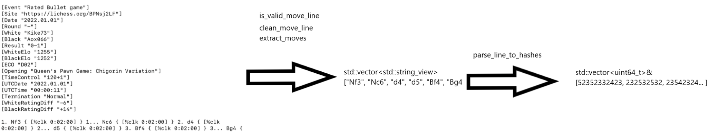

# ♟️ Lichess Data Engine
## Project overview
This project is a high-performance, C++ based program that uses .pgn.zst files from Lichess database (https://database.lichess.org/). The program streams the raw PGN data and converts it into board positions in FEN format and stores them in a SQLite database.

## Tech stack
* **Modern C++** Written in C++17.
* **SQLite** Used SQLite for the database as the goal wasn't to make a product out of this.

## Architecture and data flow

The core of the application is a multi-stage processing pipeline, visualized below:



1. **Extraction:** reader_task streams the lines from a .zst file to worker_queue.
2. **Transformation:** worker_task checks if the line is a valid game line, (filters out header lines) and places the sanitized lines in the db_queue.
4. **Loading:** Saves the FEN strings (and counts) into an SQLite database.

## Performance
This engine is optimized to handle hundreds of gigabytes of data without creating any temporary files on the disk.
~97 654 FEN/s uploaded to SQLite.

## Dependencies & prerequisites
To run the pipeline, you need:
* **zstd**: used to decompress Lichess database files. 
  * Install on Ubuntu/WSL: `sudo apt install zstd`

This project uses the following third-party libraries:
* [chess-library](https://github.com/Disservin/chess-library) by Disservin
* [SQLite3](https://www.sqlite.org/) - Database engine (standard on most Linux systems).

## Usage
### 1. Compiling
The program is built using the Makefile:

```bash
make
```

### 2. Running
Stream data directly from a compressed `.zst` file without extracting it to your hard drive:

```bash
zstd -dc lichess_db.pgn.zst | ./parser
```
